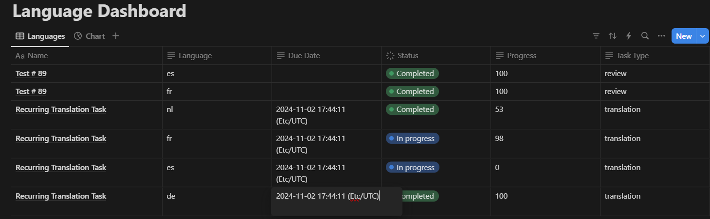

# Notion Dashboard for Tracking Lokalise Tasks at the Language Level

This folder contains Make.com workflow blueprints crafted to help Lokalise users automate localization management processes. These blueprints are designed to integrate Lokalise with Notion, providing real-time tracking of language progress across tasks.

## Blueprints Overview

### 1. **Lokalise Task Webhook Listener**

   This blueprint listens for webhook notifications from Lokalise and updates your Notion dashboard whenever a task status or language status updates.
   - **Task Created**
   - **Task Queued**
   - **Task Closed**
   - **Language Closed**

   This setup keeps your Notion dashboard synchronized with task events in Lokalise.

### 2. **Scheduled Task Progress Updater**

   This blueprint runs on a schedule that you set in Make.com. It checks the status of ongoing tasks in Lokalise and updates the Notion dashboard accordingly. The frequency of updates is fully customizable using Make.com’s scheduling options.

