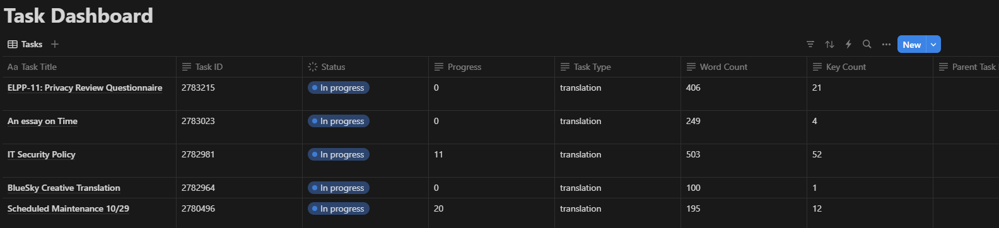

# Notion Dashboard for Tracking Lokalise Tasks at the Task Level

## Blueprints Overview

The purpose of this workflow is to track the status of Lokalise task progress in real time within Notion. 

### 1. [**Lokalise Task Webhook Listener**](./workspace/make.com-workflow-blueprints/Notion/Task_Dashboard/NotionTaskDashboardWebhook.json)

   This blueprint listens for webhook notifications from Lokalise and updates your Notion dashboard whenever a task or task status updates:
   - **Task Created**
   - **Task Queued**
   - **Task Closed**

   This setup keeps your Notion dashboard synchronized with task events in Lokalise at the task level.

### 2. [**Scheduled Task Progress Updater**](./Notion/Task_Dashboard/NotionTaskDashboardUpdater.json)

   This blueprint runs on a schedule that you set in Make.com. It checks the status of ongoing tasks in Lokalise and updates the Notion dashboard accordingly. The frequency of updates is fully customizable using Make.com’s scheduling options.

## Getting Started

1. **Import the Blueprint into Make.com**:
   - Download the blueprint file.
   - Open Make.com, go to the import function, and upload the blueprint file.
2. **Set Up API Integrations**:
   - Ensure you have API access to both Lokalise and Notion.
   - Refer to [Lokalise’s API documentation](https://developers.lokalise.com/) and [Notion’s API documentation](https://developers.notion.com/) to get the credentials.
3. **Schedule Updates (for Scheduled Task Progress Updater)**:
   - Define the update frequency according to your needs via Make.com’s scheduling options.

## Prerequisites

- **Make.com Account** with permissions to import blueprints.
- **API Access** for both Lokalise and Notion.
- **Notion Dashboard** set up to track task-level progress.