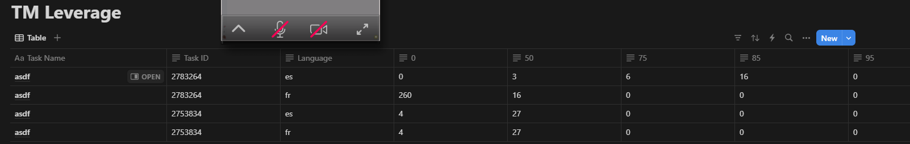

# Translation Memory Leverage Dashboard

This Make.com workflow is designed to show TM leverage in a dashboard in Notion after a Lokalise task is created. By capturing and organizing TM data, this workflow provides insight into the TM Leverage in your TMS and translation projects.

## Overview

This workflow listens for the **TM Analysis Completed** webhook event from Lokalise. You must use Tasks within Lokalise to generate TM analysises. Once the data is received, it processes the information and automatically creates or updates a TM leverage dashboard in Notion, displaying the analysis results in a clear and actionable format.

## Key Features

- **Automated Data Processing**: Receives TM analysis data directly from Lokalise when the analysis completes.
- **Notion Dashboard Creation**: Automatically updates a row in your Notion databse, with detailed metrics on TM leverage, giving your team visibility into potential savings and reuse.

## Usage

After setup, the workflow will automatically trigger whenever a TM analysis is completed in Lokalise. The TM leverage data will be formatted and sent to Notion, creating or updating the TM leverage dashboard to reflect the latest insights.